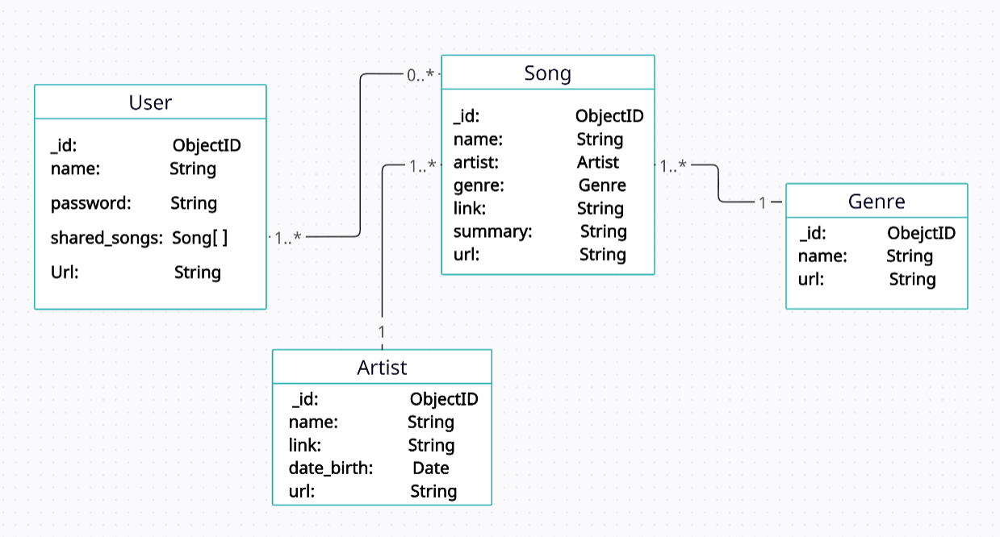

# Music Sharing app
Built using MVC design pattern.  
It allows the users do CRUD operations like:
- `GET`: (songs, artists, genres).
- `POST`: (songs, artists, genres).
- `PUT`: (songs, artists, genres).
- `DELETE`: (songs, artists, genres).
## Database Schema

## what I learned
- Handling uploded files using `multer`.
- Host Imgaes on `Cloudinary`.
- From Validation with `express-validator`.
- Mongoose.
- pug.js

## Routes needed for the LocalLibrary
- catalog/
    - The home/index page.
- catalog/`objects`/ 
    - The list of all songs, artists or genres (e.g. /catalog/songs/, /catalog/genres/, etc.)
- catalog/`object`/`id` 
    - The detail page for a specific song, artist or genre with the given _id.
- catalog/`object`/create 
    - The form to create a new song, artist or genre (e.g. /catalog/song/create).
- catalog/`object`/`id`/update 
    - The form to update a specific song, artist or genre with the given _id.
- catalog/`object`/`id`/delete 
    - The form to delete a specific song, artist or genre with the given _id.